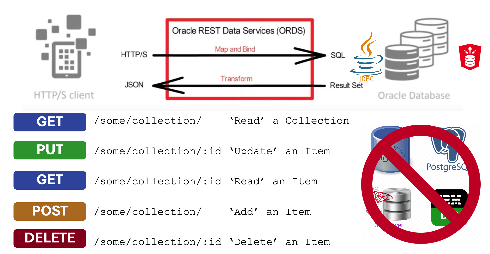

# Universal RESTful Database Access
RESTful interface to DB/2, MySQL, Oracle, PostgreSQL, and SQL Server with Standard JDBC and Oracle REST Data Services (ORDS https://oracle.com/rest). No installation of ORDS required for the target database.


## ORDS AutoREST
Oracle REST Data Services (ORDS) AutoREST is a feature that allows you to expose database tables and views as RESTful web services automatically, without writing custom REST handlers or PL/SQL code. This makes it easy to build RESTful APIs over Oracle Database objects with minimal effort.

### How ORDS AutoREST works
When AutoREST is enabled for a table or view, ORDS automatically generates RESTful endpoints that allow you to:

- Retrieve data (GET)
- Insert new records (POST)
- Update existing records (PUT/PATCH)
- Delete records (DELETE)
ORDS provides these capabilities with built-in pagination, filtering, and security options.

### Advantages of ORDS AutoREST
✔ Zero-code API – No need to write PL/SQL or Java.

✔ CRUD-ready – Supports full Create, Read, Update, Delete.

✔ Built-in security – Can integrate with OAuth, JWT, or DB authentication.

✔ Scalable – Works efficiently with Oracle Database performance features.

✔ Metadata-driven – Automatically updates when the schema changes.

### Limitations of ORDS AutoREST
The AutoREST feature does require ORDS to be installed to the target database and currently only works with the Oracle database. 


ORDS is an extensible product though. The code in this repository creates a plugin jar which provides a standards based mechanism to achieve that RESTful interface to the tables and views in the top 5 relational databases using vendor specific JDBC drivers.

# Build It
## Setup ORDS plugin jars
To build this plugin from source there are a number of dependencies to resolve. These dependencies are listed in the pom.xml. However, two ORDS plugin dependencies are mentioned which are not available in a public maven repository yet. See https://peterobrien.blog/2023/03/28/crafting-your-ords-plugin-the-maven-way/ for further details on this.

First, you’ll need to install the two ORDS jars into your local Maven repository. To install the jars, you’ll need to use the command line. Navigate to the directory where the ORDS was extracted to, and then run the following two commands:

```
mvn install:install-file \
  -DgroupId=oracle.dbtools.ords \
  -DartifactId=ords-plugin-api \
  -Dversion=24.4.0 \
  -Dpackaging=jar \
  -Dfile=examples/plugins/lib/ords-plugin-api-24.4.0.345.1601.jar  \
  -DgeneratePom=true  
```

```
mvn install:install-file \
  -DgroupId=oracle.dbtools.ords \
  -DartifactId=ords-plugin-apt \
  -Dversion=24.4.0 \
  -Dpackaging=jar \
  -Dfile=examples/plugins/lib/ords-plugin-apt-24.4.0.345.1601.jar  \
  -DgeneratePom=true
```
That will put two artefacts in your local maven repository both as version 24.4.0. That is the version of ORDS that this pom.xml refers to but you can change the version number to be reflect the version of ORDS you are using.

If you do not define these artifacts in your repository you will get this build error:
```
[ERROR] Failed to execute goal on project ords-jdbc-autorest: Could not resolve dependencies for project blog.peterobrien:ords-jdbc-autorest:jar:1.0
[ERROR] dependency: oracle.dbtools.ords:ords-plugin-api:jar:24.4.0 (compile)
[ERROR] 	Could not find artifact oracle.dbtools.ords:ords-plugin-api:jar:24.4.0 in central (https://repo.maven.apache.org/maven2)
[ERROR] dependency: oracle.dbtools.ords:ords-plugin-apt:jar:24.4.0 (compile)
[ERROR] 	Could not find artifact oracle.dbtools.ords:ords-plugin-apt:jar:24.4.0 in central (https://repo.maven.apache.org/maven2)
[ERROR] 
[ERROR] -> [Help 1]
[ERROR] 
[ERROR] To see the full stack trace of the errors, re-run Maven with the -e switch.
[ERROR] Re-run Maven using the -X switch to enable full debug logging.
[ERROR] 
[ERROR] For more information about the errors and possible solutions, please read the following articles:
[ERROR] [Help 1] http://cwiki.apache.org/confluence/display/MAVEN/DependencyResolutionException
```
## Package
Navigate to the `ords-jdbc-autorest` directory and run `mvn clean package`. You will start to see output like this...
```
[INFO] Scanning for projects...
[INFO] 
[INFO] ----------------< blog.peterobrien:ords-jdbc-autorest >-----------------
[INFO] Building ords-jdbc-autorest 1.0
[INFO]   from pom.xml
[INFO] --------------------------------[ jar ]---------------------------------
[INFO] 
[INFO] --- clean:3.1.0:clean (default-clean) @ ords-jdbc-autorest ---
[INFO] 
[INFO] --- resources:3.0.2:resources (default-resources) @ ords-jdbc-autorest ---
[INFO] Using 'UTF-8' encoding to copy filtered resources.
[INFO] skip non existing resourceDirectory ords-jdbc-autorest/src/main/resources
...
[INFO] --- jar:3.0.2:jar (default-jar) @ ords-jdbc-autorest ---
[INFO] Building jar: ords-jdbc-autorest/target/ords-jdbc-autorest-1.0.jar
[INFO] 
[INFO] --- dependency:3.8.1:copy-dependencies (copy-dependencies) @ ords-jdbc-autorest ---
[INFO] ------------------------------------------------------------------------
[INFO] BUILD SUCCESS
[INFO] ------------------------------------------------------------------------
[INFO] Total time:  2.848 s
[INFO] Finished at: 2025-03-03T21:11:34Z
[INFO] ------------------------------------------------------------------------
```
You will see exceptions for the test exections if you do not have specific MySQL and PostgreSQL databases in place. Do not worry about that. What matters is that you have all the jars you need to run this plug. For your convenience the JDBC drivers for DB/2, MySQL, PostgreSQL and SQL Server are available. The JDBC driver for Oracle RDBMS already ships with ORDS.
```
ls target/*.jar 
target/commons-lang3-3.12.0.jar           target/mssql-jdbc-12.8.1.jre11.jar    target/snakeyaml-2.2.jar            target/swagger-parser-core-2.1.22.jar
target/jackson-dataformat-yaml-2.16.1.jar target/mysql-connector-j-9.1.0.jar    target/swagger-core-2.2.21.jar      target/swagger-parser-v3-2.1.22.jar
target/jackson-datatype-jsr310-2.16.2.jar target/ords-jdbc-autorest-1.0.jar     target/swagger-models-2.2.21.jar
target/jcc-12.1.0.0.jar                   target/postgresql-42.7.4.jar          target/swagger-parser-2.1.22.jar
```

Copy these jars to the ORDS product `lib/ext` directory. Let's assume that you have an environment variable called ORDS_HOME which points to the directory that you have extracted ORDS to.
```
cp target/*.jar $ORDS_HOME/lib/ext/
```

# Configure It
This repository comes with an example configuration directory that has pools defined for all 5 databases that this plugin has been tested with. Navigate to the `example_config` directory and review the pools.
```
~/Downloads/ords-24.4.0.345.1601/bin/ords config --db-pool mysql list
ORDS: Release 24.4 Production on Mon Mar 03 21:24:45 2025

Copyright (c) 2010, 2025, Oracle.

Configuration:
  ~/ords-jdbc-autorest/example_config

Database pool: mysql
INFO: The configuration does not have any global settings specified.

Setting                 Value                                                Source     
---------------------   --------------------------------------------------   -----------
autorest.api.doc.file   databases/mysql/autorest-openapi.yaml                Pool       
db.connectionType       customurl                                            Pool       
db.credentialsSource    request                                              Pool       
db.customURL            jdbc:mysql://localhost:3306/sakila?useSSL=false&al   Pool       
                        lowPublicKeyRetrieval=true                                      
db.password             ******                                               Pool Wallet
db.username             sammy                                                Pool       
restEnabledSql.active   true                                                 Pool       

```
This configuration directory does not have a default pool but has the following 5 pools:
- db2 : DB/2
- mssql : SQL Server
- mysql : MySQL
- ora-read-only : Oracle RDBMS - This is called ora-read-only because it is not expected to have ORDS instaled
- postgres : PostgreSQL

Note that in none of these pools is the db.username an ORDS Runtime User such as ORDS_PUBLIC_USER. ORDS is not installed in these databases.
Adjust the pools to suit your needs.

## API Document
Each pool has a autorest-openapi.yaml document which describes what the AutoRESTJDBCServlet will make available. These are OpenAPI V3 documents which use an extension structure to describe the database object to be made available over REST.

```
    x-autorest:
      owner: Person
      identifier: Person
      type: table
```
The OpenAPI V3 `path` and `operation` specify what service is available and the `x-autorest` extension specify the object. Note that not all databases have a schema concept so not all documents will specify an `owner` for the object.


# Run It
With the `example_config` as your current working directory, and the plugin jars in the `lib/ext` directory, just run ORDS in standalone mode:
```
cd example_config
$ORDS_HOME/bin/ords serve
```
