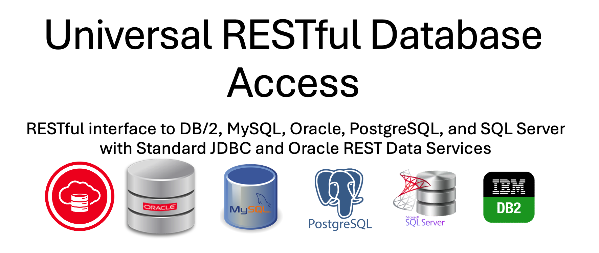

# Universal RESTful Database Access
RESTful interface to DB/2, MySQL, Oracle, PostgreSQL, and SQL Server with Standard JDBC and Oracle REST Data Services (ORDS https://oracle.com/rest). No installation of ORDS required for the target database.



## ORDS AutoREST
Oracle REST Data Services (ORDS) AutoREST is a feature that allows you to expose database tables and views as RESTful web services automatically, without writing custom REST handlers or PL/SQL code. This makes it easy to build RESTful APIs over Oracle Database objects with minimal effort.

### How ORDS AutoREST works
When AutoREST is enabled for a table or view, ORDS automatically generates RESTful endpoints that allow you to:

- Retrieve data (GET)
- Insert new records (POST)
- Update existing records (PUT/PATCH)
- Delete records (DELETE)
ORDS provides these capabilities with built-in pagination, filtering, and security options.

### Advantages of ORDS AutoREST
✔ Zero-code API – No need to write PL/SQL or Java.

✔ CRUD-ready – Supports full Create, Read, Update, Delete.

✔ Built-in security – Can integrate with OAuth, JWT, or DB authentication.

✔ Scalable – Works efficiently with Oracle Database performance features.

✔ Metadata-driven – Automatically updates when the schema changes.

### Limitations of ORDS AutoREST
The AutoREST feature does require ORDS to be installed to the target database and currently only works with the Oracle database. 


ORDS is an extensible product though. The code in this repository creates a plugin jar which provides a standards based mechanism to achieve that RESTful interface to the tables and views in the top 5 relational databases using vendor specific JDBC drivers.

# Setup ORDS plugin jars
To build this plugin from source there are a number of dependencies to resolve. These dependencies are listed in the pom.xml. However, two ORDS plugin dependencies are mentioned which are not available in a public maven repository yet. See https://peterobrien.blog/2023/03/28/crafting-your-ords-plugin-the-maven-way/ for further details on this.

First, you’ll need to install the two ORDS jars into your local Maven repository. To install the jars, you’ll need to use the command line. Navigate to the directory where the ORDS was extracted to, and then run the following two commands:

```
mvn install:install-file \
  -DgroupId=oracle.dbtools.ords \
  -DartifactId=ords-plugin-api \
  -Dversion=24.4.0 \
  -Dpackaging=jar \
  -Dfile=examples/plugins/lib/ords-plugin-api-24.4.0.345.1601.jar  \
  -DgeneratePom=true  
```

```
mvn install:install-file \
  -DgroupId=oracle.dbtools.ords \
  -DartifactId=ords-plugin-apt \
  -Dversion=24.4.0 \
  -Dpackaging=jar \
  -Dfile=examples/plugins/lib/ords-plugin-apt-24.4.0.345.1601.jar  \
  -DgeneratePom=true
```
That will put two artefacts in your local maven repository both as version 24.4.0. That is the version of ORDS that this pom.xml refers to but you can change the version number to be reflect the version of ORDS you are using.
